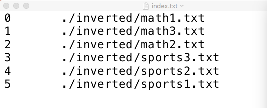
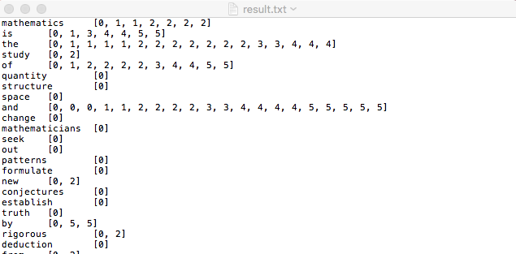

# 倒排索引

导入所需要的模块<br>
这里用的是 os 模块，来对文件进行读写操作


```python
import os
```

创建文件夹 ***result*** 来存储操作后的结果<br>
如果文件夹已经存在的话，就使用改文件夹


```python
os.makedirs('./result/', exist_ok=True)
```

## 对文件进行标号
定义一个函数 ***scanner*** ,参数是 ***文件夹路径***<br>


```python
def scanner(path):

    files = os.listdir(path)
    #用该函数，读取path目录下的所有的文件夹和文件的文件名，将结果存入 files 中

    files =  files[1:]

    '''
    macOS下会有一个布局相关文件，所以读出的文件中会有一个 .DS_Store 文件
    所以用 file[1:] 将该文件去掉
    如果运行结果没有 .DS_Store 文件的话，可以考虑删掉该行代码
    '''

    pathes = []
    #申明一个数组储存文件路径

    for file in files:
        pathes.append(os.path.join(path,file))
        #储存文件路径

    return pathes
```


```python
filePath = './inverted'

pathes = scanner(filePath)
for i in pathes:
    #查看文件路径
    print(i)
```

    ./inverted/math1.txt
    ./inverted/math3.txt
    ./inverted/math2.txt
    ./inverted/sports3.txt
    ./inverted/sports2.txt
    ./inverted/sports1.txt


```python
​```python
with open ('./result/index.txt','w') as f:
    for key,value in enumerate(pathes):
        f.write("{}\t{}\n".format(key,value))

        #将文件的 索引， 路径写入 index.txt 文件
```

## 进行倒排索引
用 ***index*** 来表示当前索引文件的序号，用 ***result*** 来存结果


```python
index = 0
result = {}

for file in pathes:
    with open(file,'r') as f:
        #读文件,去除文件中的数字，引号，句号，方括号
        text = f.read().replace(",","").replace("[","").replace("]","")\
        .replace("\"","").replace(".","").replace("0","").replace("1","")\
        .replace("2","").replace("3","").replace("4","").replace("5","")\
        .replace("6","").replace("7","").replace("8","").replace("9","")

        #把每个文本变成数组
        text = text.split(" ")

        #把结果存入 result
        for word in text:

            #统一大小写
            word = word.lower()

            #如果单词已经存在与result中，向对应的 list 中添加一个索引
            if word  in list(result.keys()):
                result[word].append(index)

            #如果单词不存在的话，建立一个 word-list 的键值对
            else:
                result[word] = [index]
            #一个单词读写完毕

    #一个文本文件读写完毕,index加一，读下一个文件
    index += 1


#结果写入result.txt文件中
with open('./result/result.txt','w') as r:
    for word in result:
        r.write('{}\t{}\n'.format(word,result[word]))
```

## 结果展示
<div>
<h3>index.txt</h3>

</div>
<div>
<h3>result.txt</h3>

</div>
