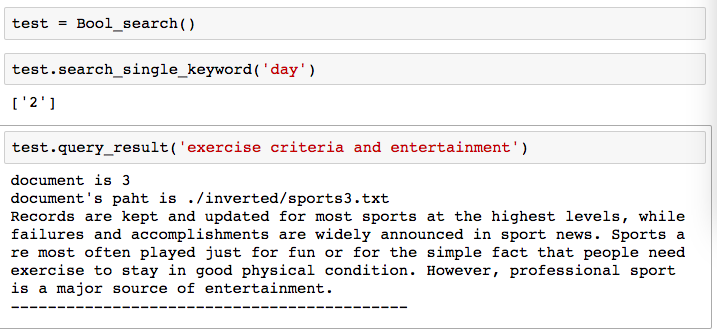

# 简单的boolean search 

### 数据与函数说明


__doc_path  是放内容的文件夹的路径<br>

__doc_index_path  是放 index -> path 的. tx t文件<br>

__word_index_path  是放 word -> file index 的 .txt 文件 <br>

__doc_index2path 是一个 index -> path 的字典<br>

__word2index  是一个 word -> file index 的字典<br>

<h4>__init__  :</h4>

<p>初始化 __doc_index2path 和 __word2index(将文件中的内容读入程序中存放)</p>

<h4>search_single_keyword :</h4>

<p>搜索单个关键字的</p>

<h4>__construct_query_tree : </h4>
<p>用输入的字符串构建查询时需要的二叉树</p>

<h4>__search_with_binary_tree :</h4>
<p>用构建好的二叉树做查询</p>

<h4>query_result : </h4>
<p>查询结果打印输出</p>


```python
class Bool_search(object):
    __doc_path = './inverted/'
    __doc_index_path = './result/index.txt'
    __word_index_path = './result/result.txt'
    __doc_index2path = {}
    __word2index = {}
    
    def __init__(self):
        pass
            
    def search_single_keyword(self, keyword):
       pass
    
    def __construct_query_tree(self, query):
        pass
       
    def __search_with_binary_tree(self, root_node):
        pass
      
    def query_result(self,query):
        pass
      
```


### 具体函数解释

#### __init___
初始化__doc_index_path和__word_index_path  

#### search_single_keyword

单个关键字用初始化好的 __word2index 直接查询

用set简单去重

```python
def search_single_keyword(self, keyword):
        return_list = []
        if keyword in self.__word2index.keys():
            return_list = list(set(self.__word2index[keyword]))
        return return_list
```

#### __construct_query_tree

```python
    def __construct_query_tree(self, query):
        
        elements = str(query).lower().split(" ")
        #把查询统一大小写为小写，用空格将各个关键字分开，得到一个list
        temp_node_list = []
        #申明一个list辅助储存
        
        i = 0
  
        while(i < len(elements)):
            element = elements[i].replace(" ","")
            #把每个关键字取出来，去掉里面的空格
            
            node = []
            #用关键字构建一棵树的 node 
            
            if str(element) == 'and':
                node.append("AND")
                #遇到 “and” ,把该 node 的 value 设成“AND”,并构建它的左右节点
                
                #left node
                left_node = (temp_node_list.pop())
                node.append(left_node)
                
                #左节点为 “and” 前的一个元素(关键字)，这个关键字已经被加到temp_node_list中去了
                #所以要将加进去的节点从temp_node_list删除
                
                
                
                #right node 
                i += 1
                right_node = []
                right_node.append(elements[i].replace(" ",""))
                right_node.append(None)
                right_node.append(None)
                node.append(right_node)
                """
                右节点就是“and”的后一个元素(关键字)
                用 i += 1 找到“and”的后一个元素(关键字)
                用这个元素构建一个节点
                再组成node的右节点
                """
                
                
            else:
                node.append(element)
                node.append(None)
                node.append(None)
                #如果不是“and”，就构建一个不带左右节点的普通节点
                
            i += 1
            temp_node_list.append(node)
            #把构建好的节点加入 temp_node_list
           
        i = 0
        last_node = temp_node_list[i]
        i += 1
        while(i < len(temp_node_list)):
            current_node = temp_node_list[i]
            or_node = []
            or_node.append("OR")
            or_node.append(last_node)
            or_node.append(current_node)
            last_node = or_node
            i += 1
        
        #temp_node_list中存放的是由
        #普通关键字组成的节点和由“and”组成的带左右子节点的节点
        #对每个节点，给他们添上一个“OR”
        #构成一颗查询树
        
        return last_node
```


#### __search_with_binary_tree :

````python
    def __search_with_binary_tree(self, root_node):
        result2return_list = []
        #申明返回查询后的结果的list
        #查询结果应到是关键字所在的文档的index
        
        node_value = root_node[0]
        
        if node_value is "AND":
            left_child_result = self.__search_with_binary_tree(root_node[1])
            right_child_result = self.__search_with_binary_tree(root_node[2])
            #如果是“AND”节点递归地搜索左右节点，
            
            for node in left_child_result:
                if node in right_child_result:
                    result2return_list.append(node)
            #因为 “AND” 是取交集，所以只有当结果在左右节点的结果中都出现 
            #才能被加入result2return_list
              
        elif node_value is "OR":
            left_child_result = self.__search_with_binary_tree(root_node[1])
            right_child_result = self.__search_with_binary_tree(root_node[2])
            
            for node in left_child_result:
                if node  not in result2return_list:
                    result2return_list.append(node)
                    
            for node in right_child_result:
                if node  not in result2return_list:
                    result2return_list.append(node)
            #如果是“OR”节点的话，取并集，去重就可以了 
            
        else:
            return self.search_single_keyword(node_value)
            #如果不是“AND”或者“OR”的话，必是关键字，搜素关键字返回结果
            
        return result2return_list
````


#### query_result

用字符串构建树<br>

用树做搜索<br>

查询结果用__doc_index2path找到文件路径<br>

读取文件内容，打印输出内容<br>

```python
    def query_result(self,query):
        query = query.lower()
        query = self.__construct_query_tree(query)
        query_result = self.__search_with_binary_tree(query)
        for doc in query_result:
            path = self.__doc_index2path[doc].replace("\n","")
            print("document is {}".format(doc))
            print("document's paht is {}".format(path))
            with open(path) as f:
                content = f.read()
                print(content)
            print("-------------------------------------------")
```


### 查询结果


